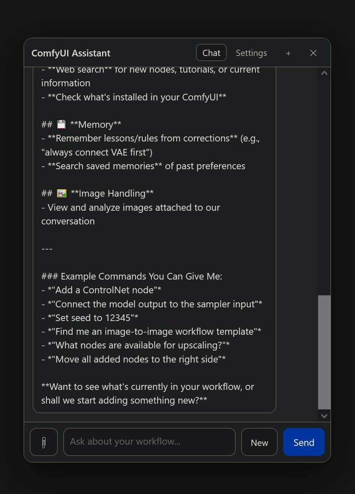

# ComfyUI Assistant

A floating chat assistant embedded in the ComfyUI graph editor. It can read and edit your workflow,
see your input/output images, search a local documentation knowledge base, and remember corrections
across sessions.




> **⚠️ Tested with LM Studio only.**
> The Ollama, OpenAI-compatible, and Anthropic providers are implemented but have **not been tested
> yet**. If you try one and it works — or breaks — please tell me via
> [GitHub Issues](https://github.com/BobbtheBuilder/ComfyUI_Assistant/issues). Feedback is very
> welcome.

## Contents

- [Features](#features)
- [Requirements](#requirements)
- [Installation](#installation)
- [Setup](#setup)
- [Provider support](#provider-support)
- [Usage](#usage)
- [Settings reference](#settings-reference)
- [Files and data](#files-and-data)
- [Debugging and reporting issues](#debugging-and-reporting-issues)
- [Troubleshooting](#troubleshooting)
- [Testing](#testing)
- [License](#license)
- [Changelog](#changelog)

## Features

### Interface
- Floating, collapsible chat bubble you can drag anywhere; smooth, GPU-composited dragging.
- Draggable panel with a streaming chat view, activity log, and error bubbles.
- **Send** turns into **Cancel** while the model is responding.
- **New** chat button next to Send.
- Each workflow keeps its **own chat session**, and sessions switch automatically when you change
  workflows.

### Workflow editing
- Reads the active workflow (nodes, titles, links, groups) and the nodes installed in ComfyUI.
- Add / remove nodes, connect / disconnect links, set widget values, and reposition nodes.
- Multi-step changes are applied in one batched call (`apply_workflow_edits`), so an edit lands as a
  single undo step instead of a long chain of round-trips.
- Writes prompts into the correct positive/negative text encoder (`set_prompt`).
- Edits are change-tracked, so they are undoable (`Ctrl+Z`) and mark the workflow modified.

### Building quality
- New nodes are placed in free space (no overlap) and can be positioned next to a neighbor.
- **Auto-arrange** lays out the nodes it added in left-to-right execution order, to the right of your
  existing graph so your layout is untouched.
- **Connection check**: after building, it validates required inputs, runs one follow-up pass to
  connect anything missing, and warns you if problems remain.

### Vision
- Sees input images and generated outputs. Input discovery is generic: any node that exposes an
  image through an `image`/`image_path` widget, a preview (`node.imgs`), a `filename`/`subfolder`
  reference, or a string referencing a `.png/.jpg/.webp/...` file is picked up.
- Also reads the **MiniMax H3 Project Asset Carousel** (`MiniMaxH3ProjectAssetManager`): its
  image assets are attached from the node's catalog via the pack's media route.
- Auto-attaches the relevant image when you mention images; attach manually via the paperclip
  (*Input image(s)*, *Last output*, *Choose file…*).
- Can write a prompt from an image, or critique/refine a prompt against the output.
- Images are downscaled (default max 1024 px, JPEG q0.85) before sending. Requires a vision model.

### Knowledge base
- Local SQLite index of installed pack docs, the official ComfyUI docs
  (`docs.comfy.org/llms-full.txt`), the GitHub wiki + README, every installed node's **full schema**
  (inputs, types, defaults, enums, tooltips, outputs), bundled **example workflows**, and the
  custom-node/manager **registry** (pack descriptions, node→pack map, model list).
- **Hybrid search**: SQLite FTS5 keyword search fused with **embedding** semantic search (LM Studio /
  Ollama / any OpenAI-compatible `/embeddings`; keyword-only when the provider has no embeddings).
- Exposed to the model via `search_docs` / `get_node_docs`.
- Built in the background on first start, updated incrementally afterwards, and re-indexed after a
  git install. Rebuild/sync/settings in **Settings → Knowledge base**.
- The index is **compacted automatically** at the end of a rebuild, and the **Compact** button
  reclaims free space on demand (SQLite `VACUUM`; enables incremental auto-vacuum afterwards).
- **The knowledge base is still a work in progress and will keep improving in future versions.**

### Memory
- Remembers corrections and preferences across sessions (`remember_lesson`).
- Relevant lessons are injected automatically; manage them in **Settings → Memory** (add/edit/
  delete/pin/clear). Auto-detects likely corrections.

### Context management
- Detects the model's context window and summarizes older turns before it overflows, so local
  models keep working in long sessions. No fixed message cap.

### Selection awareness
- When you have node(s) selected (including multi-select), the selection is shared with the model, so
  "this"/"these"/"the selected node(s)" works.
- The model can **highlight** the nodes it refers to while explaining how they work.

### Custom nodes
- Searches the web (Tavily, Brave, or SerpAPI) for node packs and **recommends** one with its
  repository URL and install instructions (`suggest_node_pack`). It does **not** install anything
  itself — you install the pack from **ComfyUI-Manager**. (This keeps the package free of runtime
  `git`/`pip` subprocess calls, as the Comfy Registry requires.)

### Providers
- LM Studio, Ollama, any OpenAI-compatible endpoint, and Anthropic.
- Native tool calling, with an inline-JSON action fallback for models that don't support tools.
- **Unload the LLM when I run a workflow** (Settings, on by default): when a workflow starts, local
  model instances are unloaded to free VRAM (LM Studio via `/api/v1/models/unload`, Ollama via
  `keep_alive: 0`). A **Unload now** button is next to the setting. Only affects local providers.

## Requirements

- ComfyUI (recent) running on Python 3.10+.
- `git` on your PATH (only needed for installing custom nodes from the UI).
- No extra Python dependencies — the node uses ComfyUI's bundled `aiohttp`.
- Optional: a Tavily/Brave/SerpAPI API key for web search.
- Optional: a vision-capable model for image features.

## Installation

**Option A — manual**

```bash
cd ComfyUI/custom_nodes
git clone https://github.com/BobbtheBuilder/ComfyUI_Assistant
```

**Option B — ComfyUI-Manager**

Manager → *Install via Git URL* → `https://github.com/BobbtheBuilder/ComfyUI_Assistant`

Then:
1. Restart ComfyUI.
2. Hard-refresh the browser (`Ctrl+F5`).
3. On first start the knowledge base builds in the background (it downloads ~9 MB of official docs);
   this can take a few minutes. Watch progress in **Settings → Knowledge Base**.

## Setup

1. Click the chat bubble and open the **Settings** tab.
2. Pick a **provider**, set the **base URL** (defaults are filled in) and an **API key** if your
   provider needs one.
3. Click **Refresh** to load the model list, choose a **model**, and press **Save**.
4. Optional: set a **web search** provider (Tavily, Brave, or SerpAPI) and its key.

Default base URLs:

| Provider | Base URL |
| --- | --- |
| LM Studio | `http://127.0.0.1:1234/v1` |
| Ollama | `http://127.0.0.1:11434/v1` |
| OpenAI-compatible | `https://api.openai.com/v1` |
| Anthropic | `https://api.anthropic.com` |

## Provider support

| Provider | Status | Notes |
| --- | --- | --- |
| **LM Studio** | ✅ Tested | Models list, streaming, native tool calling, vision, context window. |
| Ollama | ⚠️ Untested | Uses the OpenAI-compatible `/v1` endpoint; vision/context via `/api/show`. |
| OpenAI-compatible | ⚠️ Untested | Any server exposing `/chat/completions` and `/models`. |
| Anthropic | ⚠️ Untested | Messages API with tool use and image blocks. |

If you test an untested provider, please open an issue with what worked and what didn't:
https://github.com/BobbtheBuilder/ComfyUI_Assistant/issues

## Usage

Ask in plain language, for example:

- "What does this workflow do?" or "Explain how the sampler is wired."
- "Build a basic txt2img workflow with a checkpoint, two prompts, a KSampler, and a SaveImage."
- "Add a node after the selected one and connect it."
- "Does the generated image match my prompt? Suggest a better prompt." *(attach the output with the
  paperclip or just mention it)*
- "Which node pack adds face restoration? Give me the repo URL and how to install it."
- "You used the wrong sampler last time — don't do that again." *(records a lesson)*

The assistant calls tools as needed; you'll see each call in the activity log. Destructive actions
(remove node, install a pack) ask for confirmation.

While the assistant is working you can **steer it**: type a correction and press Enter. The message is
queued and applied on its next step, so it can change course without you cancelling the run. Steering
messages show with a `↪` marker. To stop entirely, use **Cancel**.

## Settings reference

| Setting | Default | Description |
| --- | --- | --- |
| Provider | LM Studio | Which backend to talk to. |
| Base URL | provider default | Endpoint root. |
| API key | empty | Stored server-side; never sent to the browser. |
| Model | empty | Selected from the provider's model list. |
| Temperature | 0.7 | Sampling temperature. |
| Max tokens | 0 (auto) | Max completion tokens per reply. `0` = half the model's detected context window; omitted when the window is unknown so the provider decides. |
| Native tool calling | On | Off = model emits fenced JSON actions (for tool-less models). |
| Show model thinking | On | Show the model's reasoning stream (`reasoning_content` / Anthropic thinking) as a collapsed block above its reply. |
| Unload the LLM when I run a workflow | On | Unload local model instances when a workflow starts (LM Studio / Ollama). |
| Let the assistant read the ComfyUI console | On | Exposes `get_console_log` so the model can read recent server console output on request. |
| System prompt | built-in | Instruction preamble. Use **Reset to default** to restore the built-in prompt. |
| Vision | auto | Detected per model; shown read-only. |
| Web search provider / key / results | Tavily / empty / 5 | Tavily, Brave, or SerpAPI. |
| Knowledge base | On | Index installed pack docs + official docs. |
| Index example workflows / registry / extended docs | On | Add bundled example workflows, the pack registry, and the wiki/README. |
| Embedding search / embedding model | On / auto | Semantic search via the provider's `/embeddings`; model auto-detected. |
| Official docs auto-update / refresh days | On / 7 | Re-fetch official docs when stale. |
| Always include last output / input images | Off | Auto-attach images to every message. |
| Auto-attach images when mentioned | On | Attach the relevant image if you refer to one. |
| Max image dimension | 1024 | Downscale before sending. |
| Selection awareness | On | Share your canvas selection with the model. |
| Highlight nodes the model refers to | On | Let the model select nodes on the canvas. |
| Auto-arrange added nodes after building | On | Lay out added nodes to the right of your graph. |
| Check connections after building | On | Follow-up pass to connect missing inputs. |
| Context window | auto (0) | Override the auto-detected window. |
| Auto-compact when over budget | On | Summarize older turns to fit. |
| Keep last messages verbatim | 12 | How many recent messages stay untouched. |
| Use saved lessons / auto-detect corrections / inject limit | On / On / 8 | Memory behavior. |
| Debug | Off | Record a privacy-safe diagnostic log. |

## Files and data

All of these live in `custom_nodes/ComfyUI_Assistant/` and are gitignored:

| File | Purpose |
| --- | --- |
| `chatbot_config.json` | Settings, including API keys. Never committed. |
| `chatbot_history.json` | Per-workflow chat history (no image data). |
| `kb_index.sqlite` | Knowledge base index (compacted automatically; the **Compact** button reclaims space). |
| `kb_cache/` | Cached official docs (~9 MB). |
| `assistant_memory.sqlite` | Saved lessons. |
| `debug.log` | Debug log (only when Debug is enabled). |

## Debugging and reporting issues

Version 0.1.0 added a privacy-first debug system:

1. Open **Settings → Debug** and tick **Enable debug logging**, then reproduce the problem.
2. Click **Copy report** (copies to clipboard) or **Download report** (saves
   `comfyui-assistant-debug.txt`).
3. Attach it to a [GitHub issue](https://github.com/BobbtheBuilder/ComfyUI_Assistant/issues).

For live run failures, the assistant can read the ComfyUI **server console** on demand via the
`get_console_log` tool (recent lines, optionally errors/warnings only). It only reads the console
when you ask it to, results are scrubbed like the report, and the feature has its own toggle
(Settings → **Let the assistant read the ComfyUI console**).

**What the report contains:** app/ComfyUI/Python versions, provider and model, feature flags, KB
status, memory count, HTTP statuses, timings, and error messages.

**What it never contains:** chat messages, prompts, system prompt, API keys, file paths, image data,
node titles, search queries, emails, or usernames. Everything is scrubbed on the server before it is
stored or exported. (Use **Clear log** to wipe it.)

## Troubleshooting

- **Model ignores tools / returns JSON as text** — turn **Native tool calling** off; the panel will
  execute fenced JSON action blocks instead.
- **Images do nothing** — you need a vision-capable (VLM) model. Check **Settings → Vision** says
  `yes`.
- **First start is slow** — the knowledge base is downloading and indexing the official docs. Watch
  **Settings → Knowledge Base**; you can disable it or use **Sync official docs** later.
- **Long chats get cut off or repeat** — reduce **Context window** or lower **Keep last messages
  verbatim** so auto-compaction kicks in sooner.
- **Port already in use by another local server** (e.g. `11434`) — change the Base URL to the port
  your provider is actually listening on.
- **Custom node install fails** — ensure `git` is on PATH and ComfyUI's Python can reach PyPI; the
  install output is shown in the chat.

## Testing

The assistant ships a **workflow-task test suite** that measures whether a model can actually operate
ComfyUI from scratch: it **builds a workflow from your description** using only the installed nodes +
the knowledge base (no hints), then modifies it with a fixed set of increasingly hard tasks, then
diagnoses a workflow you deliberately break. It runs against whichever provider is selected in
**Settings**.

**How to run (in the panel):**

1. Click **Settings → Test workflow tasks**.
2. Type **`start`**. The suite saves your current workflow, clears the canvas, and asks what to build.
3. Type the workflow you want, e.g. *"a Qwen image-edit workflow"* or *"a Krea2 Turbo workflow"*.
4. It runs the tasks **one at a time**:
   - **Build** a workflow from your description.
   - **Set a value** — set the sampler's steps.
   - **Add and wire an image-scale node** before the SaveImage.
   - **Math-driven resolution (hard)** — read the input image's size, compute 2× rounded to a multiple
     of 8 with a math node, and resize the input to it.
   - **Arrange** the workflow.
   - **Prompt from the test image** — write a describing prompt into the prompt input (adds a
     `LoadImage` if needed).
   - **Diagnose** — *you* delete one or more nodes, click Continue, and the assistant must fix it.
5. After each task a **card asks Yes / No** right in the chat — the canvas stays visible so you can
   inspect the result. While a task runs you'll see live progress (the streamed reply, each tool call,
   and a status line) and the **Send** button becomes **Cancel**.

Type `cancel` (or click Cancel) to abort. Your workflow is restored afterwards. The image task needs
the test image in ComfyUI's `input/` folder — run `python tests/install_fixtures.py` once.

**Automated (offline) tests** — standard-library `unittest`, no extra dependencies:

```bash
python -m unittest discover -s tests -v
```

These cover provider stream parsing, the shared storage/memory/KB helpers, and the KB indexer helpers.

## License

MIT © 2026 Walter Gossard — see [LICENSE](LICENSE).

If you use this code, please keep the copyright and license notice.

## Feedback

Bug reports, provider test results, and feature ideas are welcome:
https://github.com/BobbtheBuilder/ComfyUI_Assistant/issues

## Changelog

### 0.4.5

- Fixed: the knowledge base no longer crashes on startup with
  `dictionary changed size during iteration` — it indexes a stable snapshot of the node registry
  instead of reading the live mapping while ComfyUI is still loading nodes.
- Fixed: per-workflow chat ownership hardened — each workflow keeps its own session, there is no
  shared default chat, and drafts plus history reads/writes stay with the owning workflow.
- The model's **thinking** is now shown in the chat as a collapsed "Thinking…" block above each
  reply (OpenAI-compatible `reasoning_content` and Anthropic thinking). It is saved with the
  session (capped) but never sent back to the model. Toggle it in **Settings → Show model thinking**.
- Local development `docs/` are kept out of the repository and the published node archive.

### 0.4.4

- Removed the fixed 25-step agent turn cap; the assistant keeps working until the task is done
  or you cancel.
- Output tokens now default to **auto**: half the model's detected context window (LM Studio /
  Ollama / Anthropic), or your manual **Context window** override. If the window can't be
  detected (OpenAI-compatible), the cap is omitted so the provider decides. Set **Max tokens** to
  a positive number to force an explicit limit. Context compaction uses the same budget.
- `search_docs` can now filter every knowledge-base source (example workflows, the pack registry,
  and the model list) instead of only pack/official/node docs.
- The knowledge base no longer re-indexes on every ComfyUI restart. It stores a fingerprint of the
  installed nodes, the Manager files and your KB settings, and skips the rebuild when nothing
  changed (official docs still refresh on their own schedule). **Settings → Knowledge base →
  Rebuild** still forces a full rebuild.

### 0.4.3

- Published to the Comfy Registry (`comfy node install comfy-assistant`) and registered in ComfyUI-Manager.
- Replaced the `install_custom_node` tool with **`suggest_node_pack`**: the assistant now only
  recommends a pack (repo URL + install steps) and you install it via ComfyUI-Manager. Removed all
  runtime `git`/`pip` subprocess calls (the pack installer and the docs-wiki clone) to comply with the
  registry's security standards. The knowledge base's "extended docs" source is now the ComfyUI
  README (fetched over HTTP) instead of the cloned GitHub wiki.

### 0.4.2

- The knowledge base is still a work in progress and will keep improving in future versions.
- Knowledge base storage hygiene: the index is **compacted** (`VACUUM`) at the end of a rebuild and via
  a new **Settings → Knowledge base → Compact** button, and the DB is switched to incremental
  auto-vacuum. A first run reclaimed ~520 MB (871 MB → 352 MB) without touching the content.
- Test-suite prompts (build target, the manual-delete Continue, and Yes/No verdicts) now appear as
  **cards in the chat** instead of blocking pop-ups, so the canvas stays visible while you judge. The
  test run also shows **live progress** (streamed reply, tool calls, a status line) and the **Send**
  button turns into **Cancel** while it runs. The general destructive-action confirmation (remove
  node, install pack) uses the same in-chat cards now.
- Fixed chat sessions leaking across workflows: each workflow now gets its own key (saved workflows by
  path, untitled ones by a unique id), so opening a new workflow shows an empty chat instead of the
  previous workflow's conversation.
- Knowledge base: changing the embedding model now re-embeds (stored vectors are wiped) and vector
  search is guarded against dimension mismatches, so `search_docs` can't break after a model change.
  The resolved embedding model is cached instead of re-detected on every search.
- Removed a duplicated HTTP-timeout helper (web search now reuses the provider one) and a stale
  fixture reference in `tests/install_fixtures.py`.

### 0.4.0

- Safety guards when writing into node widgets: the assistant now **refuses invalid JSON** (if a value
  looks like a JSON object and doesn't parse), rejects `file:///` URLs, and caps value size, so it
  can't corrupt a JSON-widget node. The agent loop is also capped (25 steps) so a stuck model can't
  spin forever.
- Fixed the panel "refreshing"/cancelling while you type: removed the 1.5 s workflow poll (now uses
  ComfyUI's `graphChanged` event, debounced so transient changes don't reset the chat), and the
  panel now steps aside (fades, ignores clicks) while a ComfyUI dialog is focused. Enter/Esc now also
  dismiss a pending confirmation so a dialog can't leave you stuck.
- **Much richer knowledge base**: full node schemas (inputs, types, defaults, enums, tooltips,
  outputs), bundled example workflows, the custom-node/manager registry (5,900+ packs, node→pack map,
  model list), plus the GitHub wiki and README on top of the official docs.
- **Semantic (hybrid) search**: embeddings via the provider's `/embeddings` fused with keyword search
  (LM Studio, Ollama, OpenAI-compatible; keyword-only fallback). Embedding model auto-detected.
- New Settings for the extra sources and the embedding model; KB status shows per-source counts.

### 0.3.0

- Sped up multi-step workflow edits: the assistant now batches changes into a single
  `apply_workflow_edits` call (one step, one undo) instead of many separate tool calls, no longer
  makes redundant `validate_workflow`/`layout_workflow` round-trips (the app does both automatically),
  and keeps the system/tool prompt prefix stable so local models can reuse their prompt cache.
- Added **mid-run steering**: while the assistant is working, type a correction and press Enter to
  queue a new instruction for its next step, without cancelling the run. Steering messages are marked
  with a `↪` and corrections also nudge the lesson memory.
- Added a **workflow-task test suite** (**Settings → Test workflow tasks**): from an empty canvas it
  builds a workflow from your description (using only installed nodes + the KB — no hints), then runs
  a fixed set of increasingly hard modifications (set a value, add/wire a resize, math-driven
  resolution, arrange, prompt-from-image) and a diagnose step where you delete nodes. You judge each
  task **Yes/No**; your workflow is restored afterwards.
- Added a standard-library `unittest` suite under `tests/` (provider/parser, storage/memory/KB
  helpers, KB indexer helpers).
- Added `tests/install_fixtures.py` and the test image `tests/fixtures/vision_red.png` for the image task.

### 0.2.0

- Added an optional read-only **ComfyUI console** tool (`get_console_log`): the assistant can read
  recent server console lines, or only errors/warnings, to diagnose failed runs. It reads the
  console only when asked and results are scrubbed like the debug report. Enabled by default
  (Settings → **Let the assistant read the ComfyUI console**).
- Added **Unload the LLM when I run a workflow** so local models (LM Studio / Ollama) release VRAM
  before a run starts, plus an **Unload now** button.
- Fixed a broken route registration that stopped the **Memory** panel from loading or saving lessons.
- Added the `console` and `unload` settings to the debug report.
- Internal cleanup: removed dead code and consolidated duplicated helpers.

### 0.1.0

- Initial release: floating chat panel, workflow read/edit tools, knowledge base, memory, vision,
  web search, custom node install, context compaction, and a privacy-first debug system.

## Maintaining workflow chat ownership

Before changing session handling, workflow switching, history persistence, or request
lifecycle, read [Workflow chat ownership](docs/workflow-chat-ownership.md). It records
the September 2026 fix, ownership rules, known history-recovery limits, and required
regression checks. Preserve the existing LLM busy/typing indicator.
