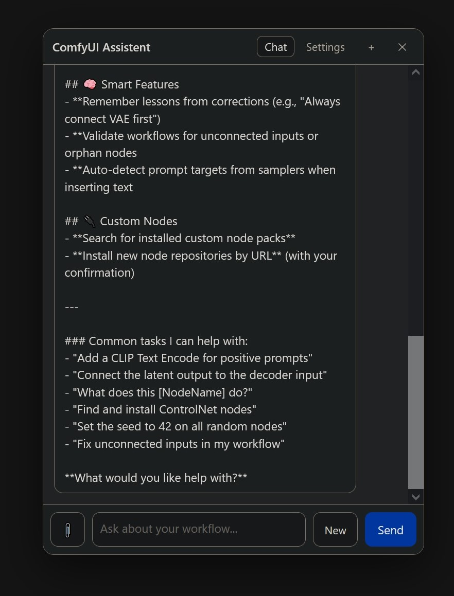

# ComfyUI Assistent

A floating chat assistant embedded in the ComfyUI graph editor. It can read and edit your workflow,
see your input/output images, search a local documentation knowledge base, and remember corrections
across sessions.




> **⚠️ Tested with LM Studio only.**
> The Ollama, OpenAI-compatible, and Anthropic providers are implemented but have **not been tested
> yet**. If you try one and it works — or breaks — please tell me via
> [GitHub Issues](https://github.com/BobbtheBuilder/ComfyUI_Assistent/issues). Feedback is very
> welcome.

## Contents

- [Features](#features)
- [Requirements](#requirements)
- [Installation](#installation)
- [Setup](#setup)
- [Provider support](#provider-support)
- [Usage](#usage)
- [Settings reference](#settings-reference)
- [Files and data](#files-and-data)
- [Debugging and reporting issues](#debugging-and-reporting-issues)
- [Troubleshooting](#troubleshooting)
- [License](#license)

## Features

### Interface
- Floating, collapsible chat bubble you can drag anywhere; smooth, GPU-composited dragging.
- Draggable panel with a streaming chat view, activity log, and error bubbles.
- **Send** turns into **Cancel** while the model is responding.
- **New** chat button next to Send.
- Each workflow keeps its **own chat session**, and sessions switch automatically when you change
  workflows.

### Workflow editing
- Reads the active workflow (nodes, titles, links, groups) and the nodes installed in ComfyUI.
- Add / remove nodes, connect / disconnect links, set widget values, and reposition nodes.
- Writes prompts into the correct positive/negative text encoder (`set_prompt`).
- Edits are change-tracked, so they are undoable (`Ctrl+Z`) and mark the workflow modified.

### Building quality
- New nodes are placed in free space (no overlap) and can be positioned next to a neighbor.
- **Auto-arrange** lays out the nodes it added in left-to-right execution order, to the right of your
  existing graph so your layout is untouched.
- **Connection check**: after building, it validates required inputs, runs one follow-up pass to
  connect anything missing, and warns you if problems remain.

### Vision
- Sees input images (from `LoadImage` nodes) and generated outputs.
- Auto-attaches the relevant image when you mention images; attach manually via the paperclip
  (*Input image(s)*, *Last output*, *Choose file…*).
- Can write a prompt from an image, or critique/refine a prompt against the output.
- Images are downscaled (default max 1024 px, JPEG q0.85) before sending. Requires a vision model.

### Knowledge base
- Local SQLite FTS5 index of every installed custom-node pack's markdown **plus the official
  ComfyUI documentation** (fetched once from `docs.comfy.org/llms-full.txt`).
- Exposed to the model via `search_docs` / `get_node_docs`.
- Built in the background on first start, updated incrementally afterwards, and re-indexed after a
  git install. Rebuild/sync manually from Settings.

### Memory
- Remembers corrections and preferences across sessions (`remember_lesson`).
- Relevant lessons are injected automatically; manage them in **Settings → Memory** (add/edit/
  delete/pin/clear). Auto-detects likely corrections.

### Context management
- Detects the model's context window and summarizes older turns before it overflows, so local
  models keep working in long sessions. No fixed message cap.

### Selection awareness
- When you have node(s) selected (including multi-select), the selection is shared with the model, so
  "this"/"these"/"the selected node(s)" works.
- The model can **highlight** the nodes it refers to while explaining how they work.

### Custom nodes
- Searches the web (Tavily, Brave, or SerpAPI) for node packs and can install one with
  `git clone --depth 1` and `pip install -r requirements.txt`, after a confirmation dialog.

### Providers
- LM Studio, Ollama, any OpenAI-compatible endpoint, and Anthropic.
- Native tool calling, with an inline-JSON action fallback for models that don't support tools.

## Requirements

- ComfyUI (recent) running on Python 3.10+.
- `git` on your PATH (only needed for installing custom nodes from the UI).
- No extra Python dependencies — the node uses ComfyUI's bundled `aiohttp`.
- Optional: a Tavily/Brave/SerpAPI API key for web search.
- Optional: a vision-capable model for image features.

## Installation

**Option A — manual**

```bash
cd ComfyUI/custom_nodes
git clone https://github.com/BobbtheBuilder/ComfyUI_Assistent
```

**Option B — ComfyUI-Manager**

Manager → *Install via Git URL* → `https://github.com/BobbtheBuilder/ComfyUI_Assistent`

Then:
1. Restart ComfyUI.
2. Hard-refresh the browser (`Ctrl+F5`).
3. On first start the knowledge base builds in the background (it downloads ~9 MB of official docs);
   this can take a few minutes. Watch progress in **Settings → Knowledge Base**.

## Setup

1. Click the chat bubble and open the **Settings** tab.
2. Pick a **provider**, set the **base URL** (defaults are filled in) and an **API key** if your
   provider needs one.
3. Click **Refresh** to load the model list, choose a **model**, and press **Save**.
4. Optional: set a **web search** provider (Tavily, Brave, or SerpAPI) and its key.

Default base URLs:

| Provider | Base URL |
| --- | --- |
| LM Studio | `http://127.0.0.1:1234/v1` |
| Ollama | `http://127.0.0.1:11434/v1` |
| OpenAI-compatible | `https://api.openai.com/v1` |
| Anthropic | `https://api.anthropic.com` |

## Provider support

| Provider | Status | Notes |
| --- | --- | --- |
| **LM Studio** | ✅ Tested | Models list, streaming, native tool calling, vision, context window. |
| Ollama | ⚠️ Untested | Uses the OpenAI-compatible `/v1` endpoint; vision/context via `/api/show`. |
| OpenAI-compatible | ⚠️ Untested | Any server exposing `/chat/completions` and `/models`. |
| Anthropic | ⚠️ Untested | Messages API with tool use and image blocks. |

If you test an untested provider, please open an issue with what worked and what didn't:
https://github.com/BobbtheBuilder/ComfyUI_Assistent/issues

## Usage

Ask in plain language, for example:

- "What does this workflow do?" or "Explain how the sampler is wired."
- "Build a basic txt2img workflow with a checkpoint, two prompts, a KSampler, and a SaveImage."
- "Add a node after the selected one and connect it."
- "Does the generated image match my prompt? Suggest a better prompt." *(attach the output with the
  paperclip or just mention it)*
- "What node pack adds face restoration? Install it if it exists."
- "You used the wrong sampler last time — don't do that again." *(records a lesson)*

The assistant calls tools as needed; you'll see each call in the activity log. Destructive actions
(remove node, install a pack) ask for confirmation.

## Settings reference

| Setting | Default | Description |
| --- | --- | --- |
| Provider | LM Studio | Which backend to talk to. |
| Base URL | provider default | Endpoint root. |
| API key | empty | Stored server-side; never sent to the browser. |
| Model | empty | Selected from the provider's model list. |
| Temperature | 0.7 | Sampling temperature. |
| Max tokens | 2048 | Max completion tokens per reply. |
| Native tool calling | On | Off = model emits fenced JSON actions (for tool-less models). |
| System prompt | built-in | Instruction preamble. |
| Vision | auto | Detected per model; shown read-only. |
| Web search provider / key / results | Tavily / empty / 5 | Tavily, Brave, or SerpAPI. |
| Knowledge base | On | Index installed pack docs + official docs. |
| Official docs auto-update / refresh days | On / 7 | Re-fetch official docs when stale. |
| Always include last output / input images | Off | Auto-attach images to every message. |
| Auto-attach images when mentioned | On | Attach the relevant image if you refer to one. |
| Max image dimension | 1024 | Downscale before sending. |
| Selection awareness | On | Share your canvas selection with the model. |
| Highlight nodes the model refers to | On | Let the model select nodes on the canvas. |
| Auto-arrange added nodes after building | On | Lay out added nodes to the right of your graph. |
| Check connections after building | On | Follow-up pass to connect missing inputs. |
| Context window | auto (0) | Override the auto-detected window. |
| Auto-compact when over budget | On | Summarize older turns to fit. |
| Keep last messages verbatim | 12 | How many recent messages stay untouched. |
| Use saved lessons / auto-detect corrections / inject limit | On / On / 8 | Memory behavior. |
| Debug | Off | Record a privacy-safe diagnostic log. |

## Files and data

All of these live in `custom_nodes/ComfyUI_Assistent/` and are gitignored:

| File | Purpose |
| --- | --- |
| `chatbot_config.json` | Settings, including API keys. Never committed. |
| `chatbot_history.json` | Per-workflow chat history (no image data). |
| `kb_index.sqlite` | Knowledge base index (~50 MB). |
| `kb_cache/` | Cached official docs (~9 MB). |
| `assistant_memory.sqlite` | Saved lessons. |
| `debug.log` | Debug log (only when Debug is enabled). |

## Debugging and reporting issues

Version 0.1.0 added a privacy-first debug system:

1. Open **Settings → Debug** and tick **Enable debug logging**, then reproduce the problem.
2. Click **Copy report** (copies to clipboard) or **Download report** (saves
   `comfyui-assistent-debug.txt`).
3. Attach it to a [GitHub issue](https://github.com/BobbtheBuilder/ComfyUI_Assistent/issues).

**What the report contains:** app/ComfyUI/Python versions, provider and model, feature flags, KB
status, memory count, HTTP statuses, timings, and error messages.

**What it never contains:** chat messages, prompts, system prompt, API keys, file paths, image data,
node titles, search queries, emails, or usernames. Everything is scrubbed on the server before it is
stored or exported. (Use **Clear log** to wipe it.)

## Troubleshooting

- **Model ignores tools / returns JSON as text** — turn **Native tool calling** off; the panel will
  execute fenced JSON action blocks instead.
- **Images do nothing** — you need a vision-capable (VLM) model. Check **Settings → Vision** says
  `yes`.
- **First start is slow** — the knowledge base is downloading and indexing the official docs. Watch
  **Settings → Knowledge Base**; you can disable it or use **Sync official docs** later.
- **Long chats get cut off or repeat** — reduce **Context window** or lower **Keep last messages
  verbatim** so auto-compaction kicks in sooner.
- **Port already in use by another local server** (e.g. `11434`) — change the Base URL to the port
  your provider is actually listening on.
- **Custom node install fails** — ensure `git` is on PATH and ComfyUI's Python can reach PyPI; the
  install output is shown in the chat.

## License

MIT © 2026 Walter Gossard — see [LICENSE](LICENSE).

If you use this code, please keep the copyright and license notice.

## Feedback

Bug reports, provider test results, and feature ideas are welcome:
https://github.com/BobbtheBuilder/ComfyUI_Assistent/issues
